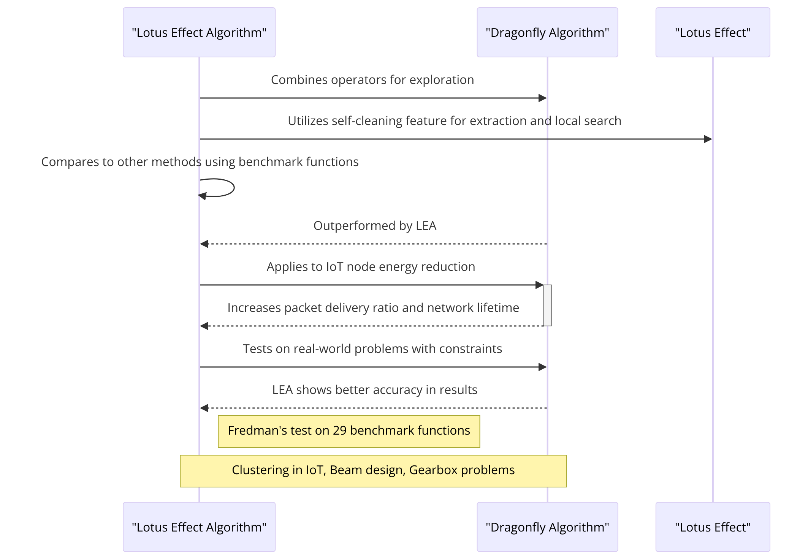
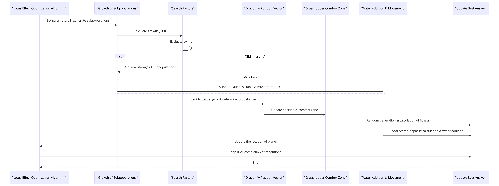

# Lotus Effect Optimization Algorithm (LEA): A Lotus Nature-Inspired Algorithm for Engineering Design Optimization of Multimodal and Unimodal Problems

This repository contains various directories, each with specific files and functionalities related to our research and development. Here's a detailed explanation of each directory:

## 1. LEA
This directory contains the primary single-objective algorithm implemented as part of our research.

## 2. LEA-EMO
This folder includes our proposed multi-modal algorithm along with the "hill-valley" functions used in the paper. It is designed to handle and demonstrate multi-modal optimization techniques.

## 3. Other test game
This directory includes various test games that are executable and represent different gaming scenarios or algorithms in action.

## 4. Run in test
This folder is divided into three subfolders:
- **fig result**: Contains MATLAB-generated images that demonstrate the multimodality of the results.
- **EMo-LEA**: Includes executable functions specific to multi-modal operations, along with their respective output images and execution displays.
- **function**: Houses multiple multi-modal functions utilized in our simulations and analyses.

## 5. Test function
Here you will find various functions used across our research, including those specifically designed for multi-modal operations that have been employed in our work.

## 6. Test game
This folder contains definitions and implementations for four games that have been developed and tested as part of our research initiatives.

Each directory is structured to support specific aspects of our research and development in algorithmic studies and gaming simulations. For further details on each file's usage and implementation, refer to the individual documents within each directory.

## How to Run the Algorithm
Here are the steps to run the algorithm:
1. Open the main file in the relevant folder.
2. Set the optimization function name within the main file.
3. Run the code and view the results.

## Sequence Diagrams
- **Unimodal Version of LEA**: 
- **Multimodal Version of LEA**: 

## Citation
If you use our Lotus Effect Algorithm (LEA) or any part of this repository in your work, please cite the following paper:
Dalirinia, E., Jalali, M., Yaghoobi, M. et al. Lotus effect optimization algorithm (LEA): a lotus nature-inspired algorithm for engineering design optimization. J Supercomput 80, 761–799 (2024). [https://doi.org/10.1007/s11227-023-05513-8](https://doi.org/10.1007/s11227-023-05513-8)
